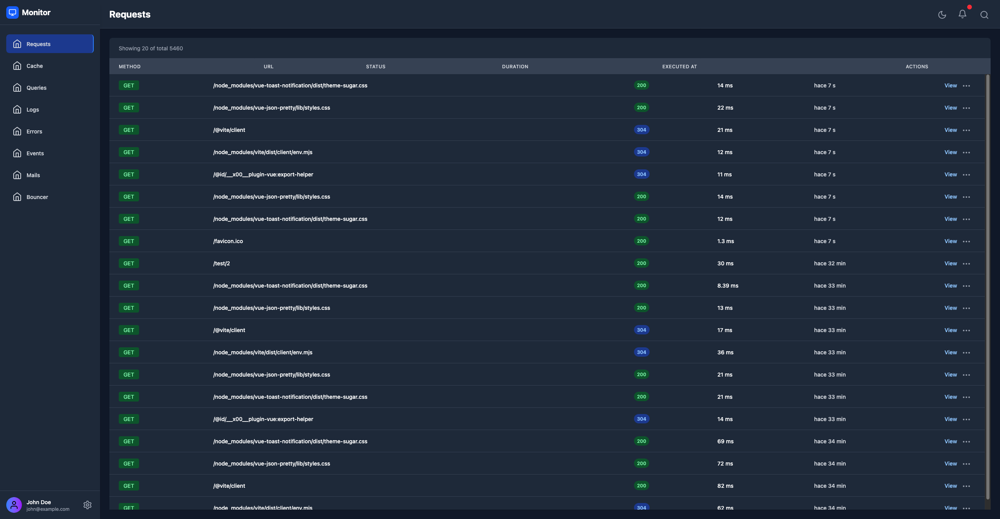

# Adonis-Monitor

A proof-of-concept plug-and-play and customizable Monitoring system that register all events in your application.

Monitors are classes that extend from the base abstract `Monitor` class this allows each monitor to define it's own configuration, transformers, filters and most importantly it's handler that will send entries to the `EntryStore` to be stored in some DB.

The `EntryStore` is also an abstract class that allows to change the default `DatabaseEntryStore` which saves all entries to an standard SQL database using Lucid.

Transformers and Filters allows the user to customize what and how the entries are save to the store, we can define filters to filter out what entries shouldn't be saved (i.e. filter out assets requests or `E_ROUTE_NOT_FOUND` errors) whilst transformers allows the user to change the data that is stored (i.e. censoring sensitive data from requests like cookies, tokens, username and passwords, etc.)

## Monitors

### - Requests

Registers all requests to the app and registers ips, request/response headers, request/response body, etc.

### - Cache

Registers all cache events:

- `cache:cleared`
- `cache:deleted`
- `cache:hit`
- `cache:miss`
- `cache:written`

### - Errors

Registers all `Error` instances that are logged with an ERROR or FATAL log level.

### - Logs

Registers all logs that are sent to the Pino bus.

### - Events

Registers all events that are sent to the `EmitterService` bus.

### - Query

Registers all database queries that are executed with bindings and duration.

### - Mail

Registers all mails that are sent.

### - Bouncer

Registers all authorization calls with data and result.

## Roadmap

- [ ] Move the monitor folder to it's own project in a monorepo style using turborepo.
- [x] Build a pretty frontend with Vue, Tailwind and Inertia.
- [ ] Create a package post install script for auto configure.
- [ ] Detach the frontend to it's own project so monitor is frontend agnostic.
- [ ] Finish implementing all default monitors:
  - [x] Requests
  - [ ] Errors
    - [ ] Collapse entries occurrences by error type (preferible at the backend side rather than the frontend side)
    - [ ] Find a way to implement Youch or something familiar to the entry view
  - [x] Cache
  - [x] Bouncer
  - [x] Events
  - [x] Logs
  - [ ] Mail (with a html preview)
  - [x] Query
  - [ ] Commands
- [ ] Find a way to link related entries like requests to every cache, bouncer, error, etc. that happened during the request.
- [ ] Fix the config file types.
- [ ] Add customizable filters and ordering.
- [ ] Add polling, WebSockets or SSE or all to refresh the entries in every index page.
- [ ] Add a global search feature
